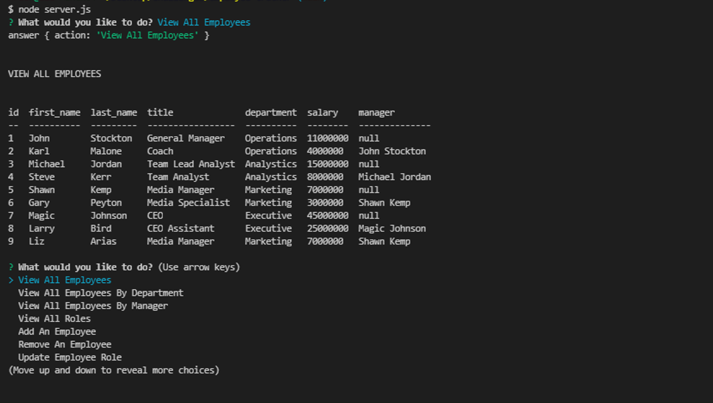

# EMPLOYEE TRACKER 

  ## Description
  A command-line application to manage a company's employee database using Node.js, Inquirer, and MySQL. It allows you to view and manage departments, roles, and employees in my company.

  ## Table of Contents

* [Installation](#installation)
* [Contributing](#contributing)
* [Questions](#questions)

## Installation 
The user needs to have Node.js installed, clone the repo, run `npm install`, `npm i inquirer` to install the inquirer package, `npm init`, `npm install mysql` to connect to the  MySQL database. After that, run `node 'server.js'` to start the application.

## License

## Contributing
Contributor Covenant.

## Questions
If you have any questions about this project, send me an email at lizethariasc14@gmail.com or contact me through my [GitHub](https://github.com/lizariasc).

## Demo Video (Click the image to go to the walkthrough video)
